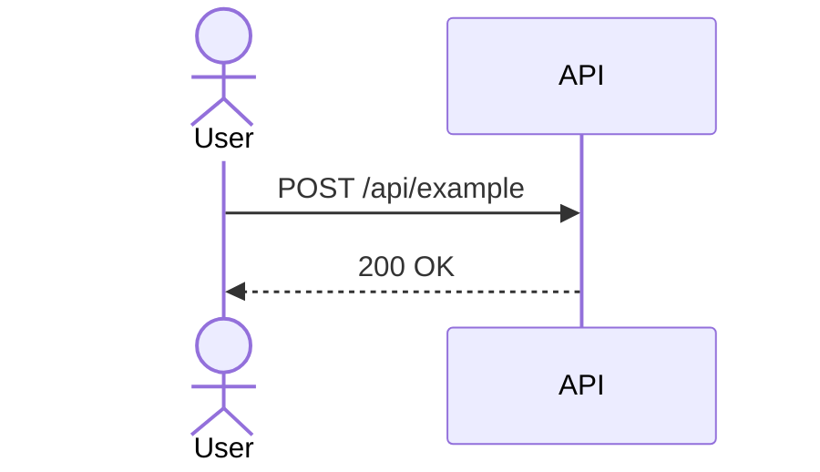

# Architecture Document — [Feature Name]

**Jira:** [ISSUE-KEY]
**Author:** Solutions Architect Agent
**Status:** Draft | Final

---

## 1. Overview

> What is being built and why.

## 2. System Components

> Describe each component involved. Include new and existing ones.

| Component | Role | Technology |
|-----------|------|-----------|
|           |      |           |

## 3. Data Models

> Schema definitions, field types, constraints, relationships.

```
# Example (Python dataclass / SQL / JSON schema)
```

## 4. API Contracts

> All new or modified endpoints.

### `POST /api/example`

**Request:**
```json
{}
```

**Response (200):**
```json
{}
```

**Errors:**
| Status | Reason |
|--------|--------|
| 400    |        |
| 401    |        |

## 5. Sequence / Flow Diagrams



## 6. External Dependencies

| Dependency | Version | Purpose |
|-----------|---------|---------|
|           |         |         |

## 7. Non-Functional Requirements

- **Performance:**
- **Scalability:**
- **Reliability:**
- **Security:**

## 8. Open Questions & Assumptions

| # | Question / Assumption | Status |
|---|----------------------|--------|
| 1 |                      | Open / Assumed |
