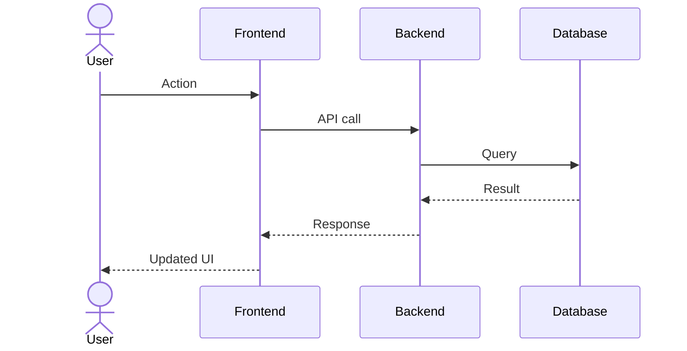

# Workflow Document — [Feature Name]

**Jira:** [ISSUE-KEY]

---

## User Flow

> Step-by-step description of what a user does and what the system does in response.

1. User does X
2. System responds with Y
3. ...

## System Flow

## Error Paths

| Scenario | System Behaviour | User Message |
|----------|-----------------|--------------|
|          |                 |              |

## Edge Cases

| Case | Handling |
|------|---------|
|      |         |

## Integration Points

> External systems, webhooks, queues, or services this feature touches.

| System | Direction | Data |
|--------|-----------|------|
|        |           |      |
